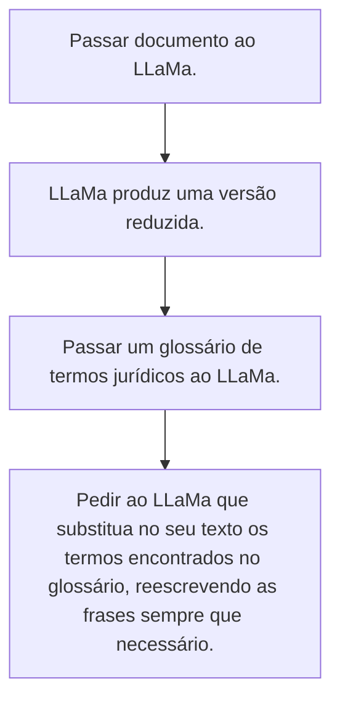

Esse documento guardará os possíveis caminhos a serem seguidos com o desenvolvimento deste projeto. Ideias diferentes serão separadas por uma linha horizontal.

---
### Situação:

O modelo não está reconhecendo os termos que deve simplificar.

### Solução:

-   Passar junto ao acórdão um glossário de termos jurídicos, indicando que a LLM deve substituir os termos do documento original pelos do glossário sempre que possível.

---

### Situação:

O modelo não está reconhecendo os termos que deve simplificar. As respostas são inconsistentes, mudando muito de uma para a outra.

### Solução:

 

Como fazer:
1.  Usar modo de QA (Questions and Answers);
2.  Enviar a instrução de redução do documento;
3.  Enviar a instrução de simplificação junto ao glossário.
4.  Coletar resposta.
